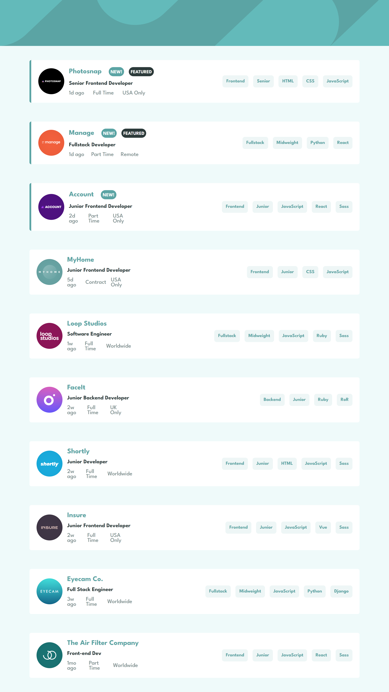

# Frontend Mentor - Job listings with filtering solution

This is a solution to the [Job listings with filtering challenge on Frontend Mentor](https://www.frontendmentor.io/challenges/job-listings-with-filtering-ivstIPCt). Frontend Mentor challenges help you improve your coding skills by building realistic projects. 

## Table of contents

- [Overview](#overview)
  - [The challenge](#the-challenge)
  - [Screenshot](#screenshot)
  - [Links](#links)
- [My process](#my-process)
  - [Built with](#built-with)
  - [What I learned](#what-i-learned)
  - [Continued development](#continued-development)
- [Author](#author)
- [Acknowledgments](#acknowledgments)

## Overview

### The challenge

Users should be able to:

- View the optimal layout for the site depending on their device's screen size
- See hover states for all interactive elements on the page
- Filter job listings based on the categories

### Screenshot



Add a screenshot of your solution. The easiest way to do this is to use Firefox to view your project, right-click the page and select "Take a Screenshot". You can choose either a full-height screenshot or a cropped one based on how long the page is. If it's very long, it might be best to crop it.

Alternatively, you can use a tool like [FireShot](https://getfireshot.com/) to take the screenshot. FireShot has a free option, so you don't need to purchase it. 

Then crop/optimize/edit your image however you like, add it to your project, and update the file path in the image above.

**Note: Delete this note and the paragraphs above when you add your screenshot. If you prefer not to add a screenshot, feel free to remove this entire section.**

### Links

- Solution URL: [Add solution URL here](https://your-solution-url.com)
- Live Site URL: [Add live site URL here](https://your-live-site-url.com)

## My process

### Built with

- Semantic HTML5 markup
- CSS custom properties
- Flexbox
- Mobile-first workflow

### What I learned

The main focus of this project is to retrieve data from a JSON and work on/with it.
I learned more about promises and how to query their different states.
Apart from continuing to use classes to make the different tasks of the application independent, every day I understand more about how to abstract the classes for each task. Even though I only have the UI class apart from App.

There is one function in particular that I would like to highlight. It is the function to filter the different jobs and display them in the HTML.

```js
function extractTags() {
    const arr = [];
    const tags = Array.from(filtersContainer.querySelectorAll(".filters__item"));

    tags.forEach(tag => {
        const dataContent = {
            type: tag.getAttribute("data-tag"),
            content: tag.getAttribute("data-content"),
        }
        arr.push(dataContent);
    });

    return arr;
}

// This is the important function :D
async function filterJobsFunction(tags) {
    jobsFilter = await loadJobs();

    if (tags.length !== 0) {
        jobsFilter = jobsFilter.filter( job => {
            return tags.every( tag => {
                if(tag.type === "roles" || tag.type === "levels") return job[tag.type] === tag.content;
                else return job[tag.type].includes(tag.content)
                
            });
        });
    }

    ui.clearArticles();
    jobsFilter.forEach( job => {
        ui.showArticle(job);
    });
}

```

As a summary. The function retrieves all the tags for filtering and in an array, which contains all the jobs, it filters according to: jobs, roles, programming languages and/or levels.

The filtering I tried to do in real time, applying a small animation to the jobs as they are displayed in the HTML.

### Continued development

My goal is always to try to think through all the logic, or at least most of it, on my own. For this reason I am aware that I can improve the following implementations:
- **The filtering of jobs:** I don't know to what extent it is advisable to make so many iterations. Now we are talking about only ten jobs, but I would like to learn a much more efficient implementation for projects with more elements.

## Author

- Website - [Mauro Centurion](https://www.github.com/maurocentu26)
- Frontend Mentor - [@maurocentu26](https://www.frontendmentor.io/profile/maurocentu26)

## Acknowledgments

To me :D (again).
